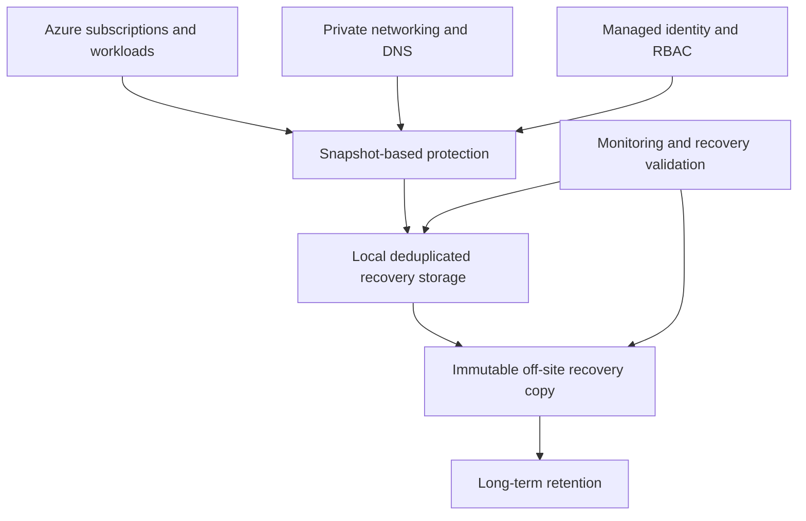

# Azure Data Protection Reference Architecture

A sanitized reference architecture for protecting business-critical workloads across multiple Microsoft Azure subscriptions. It demonstrates how operational recovery, immutable off-site protection and long-term retention can be combined into one governed recovery framework.

> This repository contains generic architecture guidance only. It intentionally excludes client names, credentials, internal addresses and proprietary configurations.

## Architecture Objectives

- Discover and protect workloads across multiple Azure subscriptions.
- Provide rapid operational recovery from local deduplicated storage.
- Maintain an independent immutable recovery copy.
- Support long-term retention through controlled archival workflows.
- Use private connectivity, private DNS, managed identities and RBAC.
- Validate backup, copy, restore and retention workflows before handover.
- Produce clear operating procedures and recovery evidence.

## Logical Architecture

## Recovery Tiers

| Tier | Purpose | Typical Characteristics |
|---|---|---|
| Operational recovery | Fast restoration of recent workloads | Local storage, deduplication, frequent protection and rapid restore |
| Off-site resilience | Independent recovery after a site or platform event | Immutable cloud copy, isolated retention and controlled access |
| Long-term retention | Governance, audit and extended preservation | Policy-driven archival and documented retrieval procedures |
| Application-aware recovery | Consistent recovery for selected applications | Coordinated snapshots, application validation and recovery testing |

## Core Design Areas

### Workload Discovery

- Define the Azure subscriptions and workload scope.
- Confirm supported operating systems and application types.
- Apply consistent tags, naming and protection-group logic.
- Validate permissions before enabling protection.

### Identity and Access

- Prefer managed identities over embedded credentials.
- Apply least-privilege RBAC at the correct scope.
- Separate platform administration from recovery authorization.
- Review access periodically and document ownership.

### Networking and DNS

- Use private connectivity where supported.
- Validate routing, NSGs, firewall paths and name resolution.
- Link the required private DNS zones to the appropriate virtual networks.
- Test communication in both directions before policy activation.

### Storage and Retention

- Size local recovery storage using protected capacity, change rate and retention.
- Allow for deduplication behavior, growth and operational headroom.
- Define immutable-copy retention independently from local retention.
- Document archival ownership, media handling and retrieval validation.

### Monitoring and Recovery Assurance

- Monitor backup jobs, copy jobs, capacity, connectivity and retention.
- Test file-level, application-level and full-workload recovery.
- Record recovery evidence, timings, issues and corrective actions.
- Revalidate after upgrades, major changes and onboarding new subscriptions.

## Implementation Sequence

1. Confirm business recovery and retention requirements.
2. Define subscriptions, workloads, ownership and classifications.
3. Complete sizing and capacity planning.
4. Prepare network paths, private DNS, identities and RBAC.
5. Deploy and integrate protection components.
6. Configure local recovery storage.
7. Create workload discovery and protection policies.
8. Configure immutable off-site copies.
9. Establish the long-term retention workflow.
10. Test backup, copy, restore and archival recovery.
11. Complete documentation, knowledge transfer and operational handover.

## Supporting Documents

- [Implementation Checklist](docs/implementation-checklist.md)
- [Recovery Validation Checklist](docs/recovery-validation-checklist.md)

## Professional Context

This reference reflects practical experience with Azure landing zones, multi-subscription workload discovery, enterprise backup platforms, private networking, managed identities, immutable retention, tape integration, troubleshooting, capacity planning and operational handover.

## Author

**Sajid Sarwar**  
Senior IT Infrastructure & Cloud Engineer  
[LinkedIn](https://www.linkedin.com/in/sajidsarwarkwt/)
